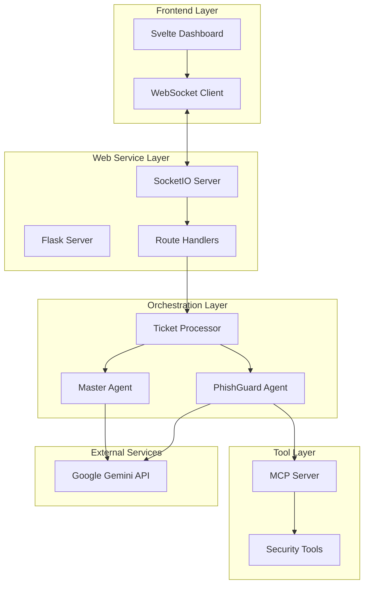

# Design Document

## Overview

NexusAI is architected as a modern, microservices-inspired autonomous IT operations platform that demonstrates advanced multi-agent AI capabilities. The system follows a layered architecture with clear separation between the agent orchestration layer, tool execution layer, web service layer, and presentation layer. The design emphasizes real-time communication, scalability, and visual appeal to create an impressive demonstration of autonomous IT operations.

## Architecture

### High-Level Architecture



### Component Architecture

The system is designed with four primary architectural layers:

1. **Presentation Layer**: Svelte-based dashboard with real-time WebSocket communication
2. **Web Service Layer**: Flask server with SocketIO for real-time updates
3. **Orchestration Layer**: Agent workflow management and coordination
4. **Tool Execution Layer**: MCP-based tool server for agent capabilities

## Components and Interfaces

### Frontend Components

#### App.svelte (Main Application)
- **Purpose**: Root component managing application state and WebSocket connections
- **Key Features**: 
  - Maintains workflow state array for real-time updates
  - Handles WebSocket events for log updates
  - Coordinates between TicketForm and WorkflowCard components
- **State Management**: Reactive Svelte stores for workflow data
- **Communication**: Socket.IO client for real-time backend communication

#### TicketForm.svelte (Ticket Creation Interface)
- **Purpose**: User interface for creating new IT support tickets
- **Key Features**:
  - Form validation and submission handling
  - Event dispatching to parent component
  - Responsive design with glassmorphism effects
- **Validation**: Client-side validation for required fields
- **Styling**: Tailwind CSS with custom focus states and transitions

#### WorkflowCard.svelte (Workflow Visualization)
- **Purpose**: Real-time visualization of agent workflow execution
- **Key Features**:
  - Dynamic status indicators with color coding and animations
  - Agent-specific icons and styling
  - Scrollable log display with fade-in animations
  - Responsive layout for multiple concurrent workflows
- **Status Management**: Dynamic status calculation based on workflow state
- **Animation**: CSS animations for smooth state transitions

### Backend Components

#### Master Agent (master_agent.py)
- **Purpose**: Intelligent ticket triage and classification
- **AI Model**: Google Gemini with specialized system prompt
- **Input**: Ticket subject line
- **Output**: Classification ('Phishing/Security' or 'General Inquiry')
- **Design Pattern**: Stateless agent with focused responsibility
- **Error Handling**: Graceful fallback to 'General Inquiry' on classification errors

#### PhishGuard Agent (phishguard_agent.py)
- **Purpose**: Autonomous phishing threat investigation and remediation
- **AI Model**: Google Gemini with security-focused system prompt
- **Workflow**: Analyze → Contain → Eradicate → Document
- **Tool Integration**: MCP client for security tool access
- **Logging**: Comprehensive action logging for UI transparency

#### Ticket Processor (ticket_processor.py)
- **Purpose**: Orchestrates the complete ticket workflow
- **Key Features**:
  - Asynchronous ticket processing
  - Real-time UI updates via SocketIO
  - Agent coordination and error handling
  - Workflow state management
- **Communication**: SocketIO event emission for UI updates
- **Error Recovery**: Graceful handling of agent failures

#### MCP Security Server (security_mcp_server.py)
- **Purpose**: Provides security tools to agents via Model Context Protocol
- **Tools Provided**:
  - `log_action_for_ui`: UI logging capability
  - `analyze_email_for_iocs`: IOC extraction from emails
  - `block_malicious_url`: Network-level URL blocking
  - `search_and_destroy_email`: Email threat removal
- **Simulation**: Realistic response times and outputs for demonstration
- **Protocol**: Standard MCP tool interface with proper error handling

### Web Service Layer

#### Flask Application (main.py)
- **Purpose**: Main application entry point and server coordination
- **Features**:
  - Automatic MCP server startup in background thread
  - Flask-SocketIO server initialization
  - Static file serving for Svelte application
- **Threading**: Daemon thread for MCP server to ensure clean shutdown
- **Configuration**: Environment-based configuration loading

#### Route Handlers (routes.py)
- **Purpose**: HTTP route management and WebSocket event handling
- **Routes**:
  - `/`: Serves main Svelte application
  - `/<path:path>`: Static file proxy for Svelte assets
- **WebSocket Events**:
  - `create_ticket`: Initiates ticket processing workflow
- **Integration**: Ticket processor integration for workflow execution

## Data Models

### Ticket Data Structure
```python
{
    "id": "SIM-A1B2C3D4",  # Unique identifier
    "subject": "Suspicious email received",  # User-provided subject
    "status": "processing",  # Current workflow status
    "created_at": "2024-01-15T10:30:00Z",  # Creation timestamp
    "logs": [  # Workflow execution logs
        {
            "agent": "Master Agent",
            "message": "Classified as Phishing/Security",
            "timestamp": "2024-01-15T10:30:05Z",
            "status": "classified"
        }
    ]
}
```

### Workflow Status States
- **received**: Ticket created and queued for processing
- **processing**: Master Agent analyzing ticket
- **classified**: Ticket categorized by Master Agent
- **delegating**: Routing to specialist agent
- **working**: Specialist agent executing remediation
- **resolved**: Workflow completed successfully
- **escalated**: Manual intervention required

### Agent Communication Protocol
```python
{
    "ticket_id": "SIM-A1B2C3D4",
    "message": "Blocking malicious URL: http://evil-site.com",
    "agent": "PhishGuard Agent",
    "status": "working",
    "timestamp": "2024-01-15T10:30:10Z"
}
```

## Error Handling

### Agent Error Recovery
- **Master Agent Failures**: Default to 'General Inquiry' classification
- **PhishGuard Agent Failures**: Log error and mark ticket as requiring manual review
- **Tool Execution Failures**: Retry mechanism with exponential backoff
- **Communication Failures**: Queue updates for retry when connection restored

### UI Error Handling
- **WebSocket Disconnection**: Automatic reconnection with exponential backoff
- **Invalid Ticket Data**: Client-side validation with user feedback
- **Server Errors**: Graceful error display without breaking UI state
- **Network Issues**: Offline indicator and queued action retry

### System-Level Error Handling
- **MCP Server Failures**: Graceful degradation with simulated responses
- **API Rate Limiting**: Request queuing and retry logic
- **Resource Exhaustion**: Circuit breaker pattern for external services
- **Configuration Errors**: Startup validation with clear error messages

## Testing Strategy

### Unit Testing Approach
- **Agent Testing**: Mock AI model responses for consistent behavior testing
- **Tool Testing**: Isolated testing of each MCP tool with various inputs
- **Workflow Testing**: State machine testing for ticket processing logic
- **UI Component Testing**: Svelte Testing Library for component behavior

### Integration Testing
- **End-to-End Workflow**: Complete ticket creation to resolution testing
- **WebSocket Communication**: Real-time update delivery verification
- **Agent Coordination**: Multi-agent workflow execution testing
- **Error Scenario Testing**: Failure mode and recovery testing

### Performance Testing
- **Concurrent Ticket Processing**: Multiple simultaneous workflow handling
- **WebSocket Scalability**: Multiple client connection testing
- **Memory Usage**: Long-running process memory leak detection
- **Response Time**: Agent response time under various loads

### Security Testing
- **Input Validation**: Malicious input handling in ticket subjects
- **API Key Security**: Environment variable and secret management
- **WebSocket Security**: Connection authentication and authorization
- **Tool Security**: MCP tool input sanitization and validation

## Deployment Considerations

### Development Environment
- **Local Development**: Single-process execution with hot reloading
- **Dependency Management**: Virtual environment with pinned versions
- **Configuration**: Environment file with development defaults
- **Debugging**: Comprehensive logging with adjustable levels

### Production Readiness
- **Process Management**: Separate processes for MCP server and web server
- **Load Balancing**: Multiple worker processes for Flask-SocketIO
- **Monitoring**: Health checks and performance metrics
- **Scaling**: Horizontal scaling considerations for agent processing

### Security Hardening
- **API Key Management**: Secure environment variable handling
- **Network Security**: Firewall rules and port restrictions
- **Input Sanitization**: Comprehensive input validation
- **Audit Logging**: Security event logging and monitoring