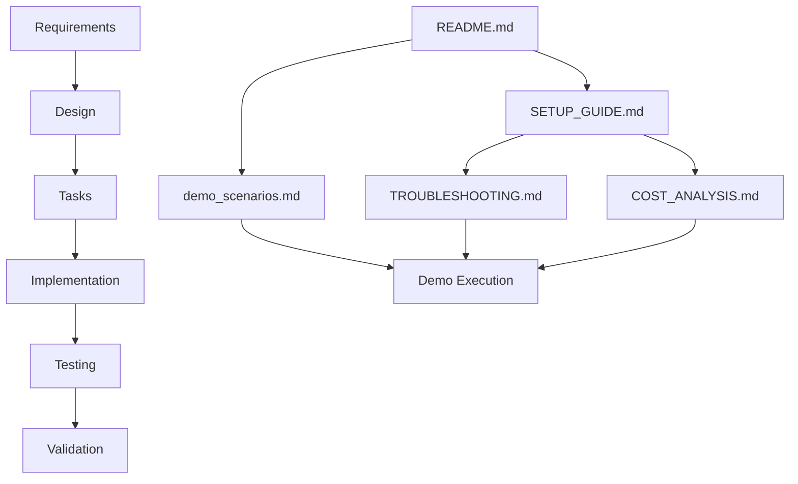

# NexusAI Documentation Index

## Quick Start Documentation

### 🚀 Getting Started
- **[README.md](README.md)** - Main project overview and quick start guide
- **[SETUP_GUIDE.md](SETUP_GUIDE.md)** - Detailed installation and configuration instructions
- **[demo_scenarios.md](demo_scenarios.md)** - Sample ticket subjects and demonstration flows

### 🔧 Operations and Maintenance
- **[TROUBLESHOOTING.md](TROUBLESHOOTING.md)** - Common issues and solutions
- **[COST_ANALYSIS.md](COST_ANALYSIS.md)** - Budget optimization and cost monitoring

## Technical Documentation

### 📋 Specifications
- **[Requirements Document](.kiro/specs/nexusai-autonomous-operations/requirements.md)** - Detailed feature requirements
- **[Design Document](.kiro/specs/nexusai-autonomous-operations/design.md)** - System architecture and component design
- **[Implementation Tasks](.kiro/specs/nexusai-autonomous-operations/tasks.md)** - Development task breakdown

### 🧪 Testing and Validation
- **[Test Documentation](tests/README.md)** - Testing strategy and test execution
- **[DEMONSTRATION_VALIDATION_SUMMARY.md](DEMONSTRATION_VALIDATION_SUMMARY.md)** - System validation results

## Documentation Usage Guide

### For Demonstrators
1. Start with **[demo_scenarios.md](demo_scenarios.md)** for sample ticket subjects
2. Follow **[SETUP_GUIDE.md](SETUP_GUIDE.md)** for complete setup instructions
3. Use **[TROUBLESHOOTING.md](TROUBLESHOOTING.md)** if issues arise during demo
4. Reference **[COST_ANALYSIS.md](COST_ANALYSIS.md)** for budget-conscious operation

### For Developers
1. Review **[Requirements Document](.kiro/specs/nexusai-autonomous-operations/requirements.md)** for feature understanding
2. Study **[Design Document](.kiro/specs/nexusai-autonomous-operations/design.md)** for architecture details
3. Follow **[Implementation Tasks](.kiro/specs/nexusai-autonomous-operations/tasks.md)** for development workflow
4. Use **[README.md](README.md)** for development environment setup

### For Evaluators/Judges
1. **[README.md](README.md)** - Project overview and capabilities
2. **[Requirements Document](.kiro/specs/nexusai-autonomous-operations/requirements.md)** - What the system accomplishes
3. **[Design Document](.kiro/specs/nexusai-autonomous-operations/design.md)** - Technical sophistication
4. **[DEMONSTRATION_VALIDATION_SUMMARY.md](DEMONSTRATION_VALIDATION_SUMMARY.md)** - Validation results

### For System Administrators
1. **[SETUP_GUIDE.md](SETUP_GUIDE.md)** - Installation and configuration
2. **[TROUBLESHOOTING.md](TROUBLESHOOTING.md)** - Issue resolution
3. **[COST_ANALYSIS.md](COST_ANALYSIS.md)** - Budget and resource management
4. **[Test Documentation](tests/README.md)** - System validation procedures

## Document Relationships

## Documentation Maintenance

### Update Frequency
- **README.md**: Update with major feature changes
- **SETUP_GUIDE.md**: Update when installation process changes
- **demo_scenarios.md**: Add new scenarios as system capabilities expand
- **TROUBLESHOOTING.md**: Add new issues as they are discovered and resolved
- **COST_ANALYSIS.md**: Update when API pricing or usage patterns change

### Version Control
All documentation is version-controlled alongside the codebase. When making changes:
1. Update relevant documentation files
2. Test documentation accuracy with actual system
3. Commit documentation changes with descriptive messages
4. Update this index if new documents are added

## Feedback and Improvements

### Documentation Quality Checklist
- [ ] Instructions are clear and actionable
- [ ] Examples are current and working
- [ ] Troubleshooting covers common issues
- [ ] Cost analysis reflects current pricing
- [ ] Demo scenarios are engaging and realistic

### Contributing to Documentation
1. Test all instructions on a clean environment
2. Include specific error messages and solutions
3. Provide multiple approaches when possible
4. Keep language clear and jargon-free
5. Update related documents when making changes

This documentation suite provides comprehensive coverage for all aspects of NexusAI setup, operation, and demonstration.